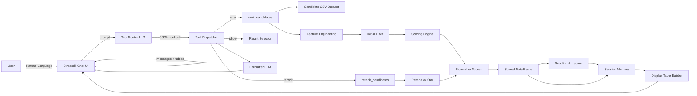

# Candidate Ranking Chatbot  
## LLM-Assisted Candidate Search, Ranking, and Interactive Reranking

This project implements an **end-to-end candidate ranking system** that combines a **custom scoring pipeline**, **interactive reranking via user feedback**, and an **LLM-assisted Streamlit chat interface**.

The system allows users to search, rank, inspect, and iteratively refine candidate lists using natural language commands while ensuring that all ranking decisions remain **deterministic, transparent, and data-driven**.

---

## 📘 Project Overview

The central goal of this project is to create an **intuitive human-in-the-loop candidate ranking workflow** that balances automation with user control.

The repository is split into three tightly coupled components:

1. **Candidate Ranking Pipeline**
   - Feature engineering
   - Keyword-based filtering
   - Scoring and normalization
   - Deterministic ranking outputs

2. **Chat-Based Control Layer**
   - Natural language tool routing
   - Strict JSON-based command execution
   - Stateless LLM decision-making

3. **Streamlit Application**
   - Chat interface for interaction
   - Persistent session memory
   - Tabular result visualization

A key design principle is **clear separation of concerns**:  
the LLM orchestrates actions and explanations, while all ranking logic is handled by deterministic Python code.


---

---

## 🧾 Dataset Description

The system operates on a structured candidate dataset containing the following fields:

| Column | Description |
|------|------------|
| `id` | Unique candidate identifier |
| `job_title` | Candidate’s current or target role |
| `location` | Geographic location |
| `connection` | Networking or connection strength |
| `fit` | Base relevance or suitability indicator |

Additional engineered features (e.g., keyword similarity, base scoring signals) are derived during the ranking process.

---

## ⚙️ Ranking Workflow

### 1. Data Preparation
- Candidate data is loaded from a CSV source.
- Feature engineering is applied consistently across runs.
- Derived numerical and textual features are added.

### 2. Initial Filtering
- Candidates are filtered using keyword relevance thresholds.
- This step reduces noise and improves ranking efficiency.

### 3. Scoring
Each candidate receives a relevance score based on:
- Keyword similarity to the target job title
- Connection strength (log-scaled)
- Optional learned model outputs (when available)

A composite base score is computed for every candidate.

### 4. Normalization
- Scores are normalized to a common scale.
- Normalized scores enable fair ranking comparisons.

### 5. Ranking Output
Two complementary outputs are produced:

1. **Results List**
   - Lightweight objects containing `{id, score}`
   - Used exclusively for ranking order

2. **Scored DataFrame**
   - Full candidate records including:
     `id, job_title, location, connection, fit`
   - Augmented with scoring features

---

## 🔁 Interactive Reranking (Human-in-the-Loop)

The system supports **iterative reranking** using direct user feedback:

1. A user stars a candidate
2. Candidate similarity to the starred profile is emphasized
3. Scores are recomputed and renormalized
4. The ranking is updated immediately

This approach enables refinement without retraining a model while keeping user intent central to the decision process.

---

## 💬 Chat-Based Control (LLM Tool Routing)

A large language model is used strictly for **control flow and narration**, not for scoring or ranking.

Supported tools include:

1. **rank**
   - Rank candidates for a specified job title

2. **rerank**
   - Rerank candidates using a starred reference

3. **show**
   - Display the top *N* candidates

4. **set_job**
   - Update or store the target job title

5. **help**
   - Explain valid commands and usage

All tool decisions are returned as **strict JSON**, ensuring safe and deterministic execution.

---

## 🖥️ Streamlit Application

The Streamlit app provides:

- A chat-style interface for issuing commands
- Stateful session memory across interactions
- Ranked candidate lists displayed as interactive tables
- Clear separation between chat narration and data output

### Ranking Table Output

Each ranking snapshot includes:

| rank | id | score | job_title | location | connection | fit |
|----|----|------|----------|----------|-----------|-----|

Tables are treated as the **source of truth**, while chat responses serve as brief explanations.

---

## 📊 Design Principles

- **LLM ≠ decision maker**  
  The language model never ranks candidates.

- **Deterministic and explainable**  
  Ranking logic is transparent and reproducible.

- **Human-in-the-loop refinement**  
  User input directly influences ranking outcomes.

- **Stateful interaction**  
  Session memory enables conversational refinement.

---

## 🗂 Repository Structure

```pgsql
├── app.py                         # Streamlit application entrypoint
├── requirements.txt               # Python dependencies
├── README.md                      # Project documentation
├── data/
│   └── candidates.csv             # Candidate dataset
├── src/
│   ├── models/
│   │   ├── assistant.py           # LLM tool router and formatter
│   │   ├── ranker.py               # Ranking pipeline
│   │   ├── feedback.py             # Star-based reranking logic
│   │   └── scoring.py              # Scoring and normalization
│   ├── data/
│   │   └── LoadData.py             # Data loading utilities
│   └── features/
│       └── feature_engineering.py  # Feature construction helpers
└── notebooks/
    └── exploration.ipynb           # Analysis and experimentation
